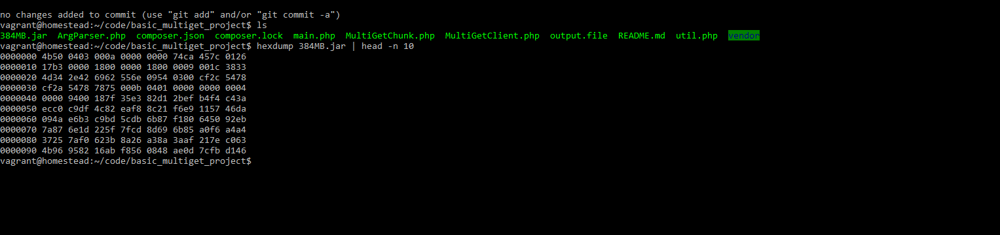
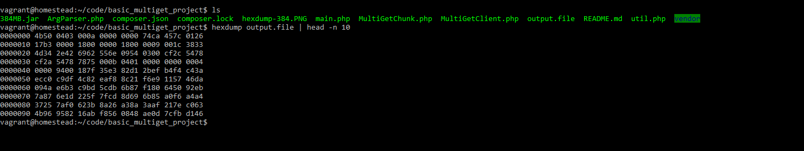

# Overview:

This is a sample application, which is being used to gague my understanding of MultiPart Get requests using Range Headers.

The application must be able to download a file by using consecutive GET requests with Range Headers specified to a particular file length.

The application was tested on the latest [Homestead](https://laravel.com/docs/5.6/homestead) VM. Which includes:

**Ubuntu 18.04**

**PHP 7.2**

## Installation:

**NOTE**: This assumes you have [Composer](https://www.getcomposer.com) installed, if you do not please visit the link before continuing.

As this is a PHP application, it relies on a few different `composer` packages to be able to work correctly. 

After cloning, run `composer install` to install the direct dependencies for the application.

The two biggest dependecies used in the app are:

[Guzzle](www.github.com/guzzle/guzzle) an object oriented cURL wrapper written in PHP. This is primarily to make HTTP interactions alot easier to deal with.

[Measurements Bytes](https://github.com/arnovr/measurements-bytes) A package to help with working with byte sizes.

Once installed you can run the application by typing:

`php main.php`

within the application direcctory.

## Definitions:

**SEGMENT**: A segment is a target amount of bytes that the application needs to get from the destination. A segment in our context would be 4MB.

**CHUNK**: A chunk is the amount of a file we want to get for each stream action. In our case we wanted 1MB chunks.

## Usage:

The basic usage of the application is governed by command line switches.

|  Switch | Function   |  Optional  |
|---|---|---|
| -u | URL  | False  |
|  -c | How big you want each chunk to be    | True   |
| -s  | How big you want each segment to be  | True   |
| -o  | The output filename defaults to "output.file"  | True |

**NOTE:** There are no spaces in between arguments.

So instead of `php main.php -o filename` it would be `php main.php -ofilename`

## Validation: 

To make sure the file was streaming correctly. I downloaded the file myself, and compared the first 100 bytes using `hexdump(1)`.

* Hexdump Of 384MB.jar:

* Hexdump Of output.file:

